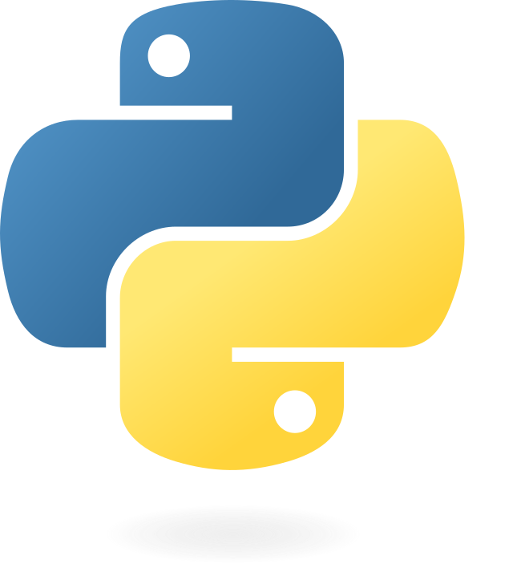

# Proceso ETL con Diferentes Orígenes o Fuentes de Datos (Data Source)

## Descripción General
El estudiante aplicará los conceptos del proceso ETL (Extracción, Transformación y Carga de datos), así como los comandos básicos utilizados en el análisis de datos usando la herramienta Jupyter Notebook y el lenguaje de programación Python, a través de las librerías apropiadas.

---

## Actividades

### 1. Base de Datos Relacional (MySQL)
- **Carga de datos:** Realizar la carga de un conjunto de datos a través de la conexión a una base de datos relacional (MySQL). **(REALIZADO)**
- **Limpieza de datos:** Aplicar mecanismos de limpieza de datos al DataFrame importado. **(REALIZADO)**
- **Transformación de datos:** Aplicar mecanismos de transformación de datos al DataFrame importado. **(REALIZADO)**
- **Carga/Exportación de datos:** Realizar la carga o exportación de datos. **(REALIZADO)**

### 2. API Pública
- **Carga de datos:** Realizar la carga de un conjunto de datos a través de la conexión a una API pública. **(REALIZADO)**
- **Limpieza de datos:** Aplicar mecanismos de limpieza de datos al DataFrame importado. **(REALIZADO)**
- **Transformación de datos:** Aplicar mecanismos de transformación de datos al DataFrame importado. **(REALIZADO)**
- **Carga/Exportación de datos:** Realizar la carga o exportación de datos. **(REALIZADO)**

### 3. Extra: Base de Datos No Relacional (MongoDB)
- **Carga de datos:** Realizar la carga de un conjunto de datos a través de la conexión a una base de datos no relacional (MongoDB). **(REALIZADO)**
- **Limpieza de datos:** Aplicar mecanismos de limpieza de datos al DataFrame importado. **(REALIZADO)**
- **Transformación de datos:** Aplicar mecanismos de transformación de datos al DataFrame importado. **(REALIZADO)**
- **Carga/Exportación de datos:** Realizar la carga o exportación de datos. **(REALIZADO)**

---

## Herramientas Utilizadas
- **Jupyter Notebook**
- **Python**
- **Librerías:** pandas, sqlalchemy, requests, pymongo, entre otras.

## Objetivo
Desarrollar habilidades prácticas en la manipulación de datos provenientes de diferentes fuentes, aplicando el proceso ETL completo y utilizando herramientas modernas de análisis de datos.

